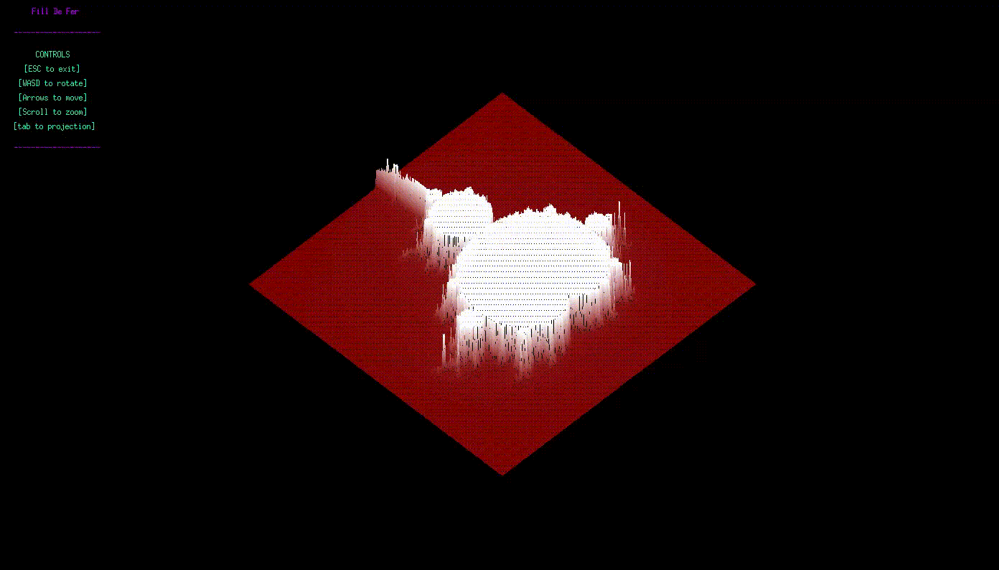

# FdF - Fil de Fer


## 💡 Overview
**FdF** (Fil de Fer) is a 3D wireframe terrain renderer developed as part of the 42 School curriculum. The project involves reading a map file containing altitude coordinates and rendering a 3D representation of the landscape. It is a deep dive into computer graphics, coordinate systems, and real-time user interaction using the **MiniLibX** library.

<p align="center">
  
</p>


## 🛠️ Features
- **Projections:** Toggle between **Isometric** and **Parallel** (Top-down) views.
- **Transformations:** Real-time **Rotation** (X, Y, Z axes), **Zooming**, and **Translation**.
- **Color Support:** Renders elevation-based color gradients.
- **Optimization:** Uses **Bresenham's line algorithm** and image buffering to prevent flickering.

## 🚀 Getting Started

### Prerequisites
You will need a C compiler (`clang` or `gcc`) and the standard X11 graphics libraries.

### Installation
1. Clone the repository:
   ```bash
   git clone https://github.com/Nicholas-Saraiva/FdF.git
   cd FdF
   ```
2. Compile the project:
   ```
   make
   ```
3. Run the renderer with a map:
   ```
   ./fdf test_maps/elem-fract.fdf
   ```

## 🎮 Controls

| Key | Action |
| :--- | :--- |
| **Arrows (Up/Down/Left/Right)** | Move (Translate) the map |
| **W / S** | Rotate around X-axis |
| **A / D** | Rotate around Y-axis |
| **Q / E** | Rotate around Z-axis |
| **Tab** | Toggle Projection (Isometric / Plane) |
| **Esc** | Close the program |


## 📌 Project Overview

Each value in the map corresponds to a point in 3D space:

* **X (abscissa)** → horizontal position in the grid
* **Y (ordinate)** → vertical position in the grid
* **Z (altitude)** → height of the point

The program connects neighbouring points using line segments to create a wireframe representation of the terrain.

Example map:

```
0 0 0 0
0 2 4 0
0 4 8 0
0 0 0 0
```

This produces a small mountain when rendered.


## 📐 Technical Implementation

### 1. The Graphics Pipeline

Each point from the input file is stored in a **2D array of structures**.
During the render loop:

1. Points are **scaled and rotated**.
2. 3D coordinates are **projected into 2D screen space**.
3. Lines are drawn between adjacent points using **Bresenham's Algorithm**.

This produces the final **wireframe mesh** visible on screen.

---

### 2. Math & Projections

To achieve the **Isometric view**, the following transformations are applied:

```
x_iso = (x - y) * cos(0.523599)
y_iso = (x + y) * sin(0.523599) - z
```

Where:

* **0.523599 radians = 30°**
* The transformation converts **3D coordinates into 2D screen space**.

## 📁 Project Structure

- **srcs/math/** - Rotation matrices and projection formulas.
- **srcs/render/** - Line drawing and image buffer handling.
- **srcs/map/** - Parser for .fdf files.
- **srcs/hooks/** - Controls configuration.
- **header/** - Header files.
- **include/** - libraries (Libft, GNL).